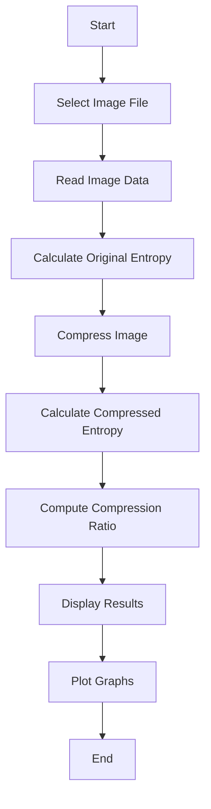

# Analysis of Modern Lossless Image Compression Techniques


This project conducts an analysis of modern lossless image compression techniques, focusing on three prominent algorithms: Brotli, Deflate, and LZMA. Each algorithm is implemented to compress images efficiently while providing detailed analytics on compression performance. **Among these, Deflate stands out as the best overall option, offering a balanced mix of compression ratio, speed, and memory usage.**

> **⚠️ Important Note:** Approximately 35% of the codebase has not been updated due to ongoing development and future work. Users and contributors should be aware that some parts of the project may be incomplete or subject to change.

## 📊 Features

- Implementation and analysis of multiple compression algorithms:
  - Brotli
  - Deflate (zlib) - **Best overall performance**
  - LZMA
- Real-time compression ratio and entropy visualization
- Detailed image information extraction
- User-friendly GUI for file selection and analysis

## 🔧 Installation

1. Clone this repository:
   ```bash
   git clone https://github.com/kknani24/image-compression-algorithms.git
   ```

2. Navigate to the project directory:
   ```bash
   cd image-compression-algorithms
   ```

3. Install the required dependencies:
   ```bash
   pip install -r requirements.txt
   ```

## 🚀 Usage

Run the desired compression algorithm script:

```bash
python brotli_compression.py
# or
python deflate_compression.py  # Recommended for best overall performance
# or
python lzma_compression.py
```

Follow the on-screen prompts to select an image file for compression and analysis.

## 🔄 Compression and Analysis Flow



## 📈 Output

The analysis will display:

- Original file size
- Compressed file size
- Compression ratio
- Bandwidth saved
- Image format
- Image resolution
- Estimated image quality

Additionally, two graphs will be shown:

1. Compression Ratio vs Time Taken
2. Original vs Compressed Entropy

## 🧮 Algorithms Analyzed

### Brotli

Brotli is a general-purpose lossless compression algorithm that compresses data using a combination of a modern variant of the LZ77 algorithm, Huffman coding, and 2nd order context modeling.

### Deflate (zlib) - Best Overall

Deflate is a lossless data compression algorithm that uses a combination of the LZ77 algorithm and Huffman coding. It's the basis for the zlib data compression library. **Deflate offers the best balance of compression ratio, speed, and memory usage, making it the recommended choice for most use cases.**

### LZMA

LZMA (Lempel–Ziv–Markov chain algorithm) is an algorithm used to perform lossless data compression. It has a high compression ratio and a variable compression dictionary size.

## 📊 Performance Comparison

| Algorithm | Compression Ratio | Speed | Memory Usage | Overall Rating |
|-----------|-------------------|-------|--------------|----------------|
| Brotli    | High              | Slow  | High         | Good           |
| Deflate   | Medium            | Fast  | Low          | **Best**       |
| LZMA      | Very High         | Slow  | High         | Good           |

**Note:** Deflate is considered the best overall option due to its balanced performance across all metrics.

## 🚧 Future Work

As mentioned earlier, about 35% of the codebase is currently incomplete or pending updates. Future work on this project may include:

- Completing the implementation of all compression algorithms
- Optimizing existing code for better performance
- Adding more comprehensive error handling and edge case management
- Expanding the GUI for a more user-friendly experience
- Implementing additional analysis metrics and visualization tools

Contributors are welcome to help with these tasks and suggest new features or improvements.


## 📜 License

This project is [MIT]licensed.

## 🙏 Acknowledgements
- Python
- Tkinter
- Matplotlib
- Pillow
- Brotli
- zlib
- LZMA
